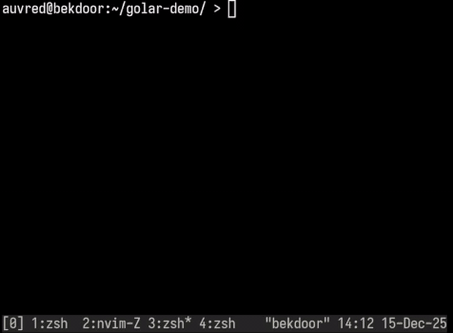

# Golar

> Architecture is inspired by [@johnsoncodehk](https://github.com/johnsoncodehk)'s [Volar.js](https://github.com/volarjs/volar.js).

## Plans

* Full Vue support
* Angular
* Svelte
* Astro
* MDX
* Ember
* type aware linting + custom JS plugins?

## License

[MIT](./LICENSE)
